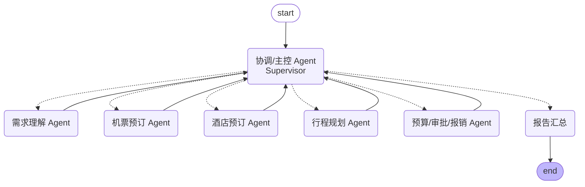

# 智能商旅多智能体框架（Business Travel Multi-Agent Framework）

基于 [LangGraph](https://github.com/langchain-ai/langgraph) 实现的企业智能商旅多智能体系统。
用户用一句自然语言描述出差需求，系统由多个各司其职的智能体协作完成
需求理解、机票预订、酒店预订、行程规划、预算审批，最终产出一份可直接
使用的出差方案。

## 架构设计

采用 **Supervisor（主控/协调）模式**：各专业 Agent 之间互不直接调用，
全部通过读写共享的全局 State 交互，由 Supervisor 在每一轮结束后根据
当前 State 动态决定下一步交给哪个 Agent，直到判定流程完成。



### 智能体角色

| Agent | 职责 | 位置 |
|---|---|---|
| 协调/主控 Agent（Supervisor） | 读取共享 State，动态决定下一步调用哪个 Agent，或判定流程结束 | `agents/supervisor.py` |
| 需求理解 Agent | 把用户自然语言请求解析为结构化字段（出发地/目的地/日期/预算/舱位偏好等） | `agents/requirement_agent.py` |
| 机票预订 Agent | 调用机票查询工具获取候选航班，结合需求与预算选出最合适的一个 | `agents/flight_agent.py` |
| 酒店预订 Agent | 调用酒店查询工具获取候选酒店，结合需求与预算选出最合适的一个 | `agents/hotel_agent.py` |
| 行程规划 Agent | 整合已选航班/酒店，生成逐日行程安排 | `agents/itinerary_agent.py` |
| 预算/审批/报销 Agent | 校验总花费是否符合企业差旅政策，超支则打回重选 | `agents/budget_agent.py` |
| 报告汇总节点 | 流程结束后把所有结果整理成一份 Markdown 方案 | `agents/report_agent.py` |

### 关键机制

- **共享状态（Shared State）**：`state.py` 中的 `TravelState` 是所有 Agent
  读写的单一数据源，包含需求、候选/已选航班与酒店、行程、预算审批结果、
  消息轨迹等，实现 Agent 间解耦协作。
- **动态路由**：Supervisor 每轮都用 LLM 重新判断"现在该做什么"，而不是写死
  一条固定流水线，因此可以处理各种中间状态。
- **反馈闭环**：如果预算审批未通过，Supervisor 会把流程路由回机票/酒店
  Agent，要求重新选择更经济的方案，体现真实业务中的"审批打回重选"。
- **防死循环**：`iteration` 计数器 + `MAX_ITERATIONS` 上限，超过后
  Supervisor 强制 FINISH，避免反复打回导致无限循环。
- **工具与 Agent 分离**：`tools/` 目录下是模拟的外部系统（机票查询、
  酒店查询、差旅政策引擎），真实项目中可直接替换为携程/航司/OA
  系统等真实 API，Agent 逻辑不需要改动。
- **LLM 提供方可插拔**：`config.py` 通过环境变量在 Anthropic / OpenAI
  之间切换，所有 Agent 都通过 `build_chat_model()` 获取模型实例。

## 目录结构

```
src/biz_travel_agents/
├── agents/                 # 各智能体节点
│   ├── supervisor.py       # 协调/主控 Agent
│   ├── requirement_agent.py
│   ├── flight_agent.py
│   ├── hotel_agent.py
│   ├── itinerary_agent.py
│   ├── budget_agent.py
│   └── report_agent.py
├── tools/                  # 模拟外部系统（可替换为真实 API）
│   ├── flight_tools.py
│   ├── hotel_tools.py
│   └── policy_tools.py
├── config.py                # LLM 提供方配置（Anthropic / OpenAI 可切换）
├── state.py                 # 多智能体共享状态定义
├── graph.py                 # LangGraph 执行图构建
└── main.py                  # 命令行入口
tests/                       # 单元测试（工具函数 + 桩 LLM，无需真实 API Key）
```

## 快速开始

### 1. 安装依赖

```bash
python -m venv .venv
.venv\Scripts\activate        # Windows
pip install -r requirements.txt
```

### 2. 配置 LLM

复制 `.env.example` 为 `.env`，填入 API Key：

```bash
LLM_PROVIDER=anthropic        # 或 openai
LLM_MODEL=claude-sonnet-5     # 可选，留空使用默认值
ANTHROPIC_API_KEY=sk-xxx
```

### 3. 运行

```bash
python -m biz_travel_agents.main "帮我订下周一从北京到上海出差的机票和酒店，住两晚，预算4000元"
```

或不带参数进入交互式输入。运行时会实时打印每个 Agent 的执行日志，
最后输出完整的出差方案（Markdown）。

## 测试

测试不依赖真实 API Key：工具函数测试直接跑真实逻辑，Agent 节点测试
用桩（stub）LLM 替换真实模型调用，只验证"给定 LLM 决策后 State 是否
被正确更新"这部分框架逻辑。

```bash
pytest -q
```

## 扩展方式

- **接入真实 API**：把 `tools/` 下的函数实现换成真实的机票/酒店/OA
  接口调用即可，Agent 与 Graph 代码都不需要改动。
- **新增智能体**：在 `agents/` 下新增一个节点函数，在 `graph.py` 中
  注册节点、加回 Supervisor 的边，并在 `supervisor.py` 的
  `RouteDecision.next` 枚举与提示词中补充新角色即可。
- **更换编排模式**：如需固定流水线而非动态路由，可直接用
  `graph.add_edge` 串联各 Agent，去掉 Supervisor 节点。
